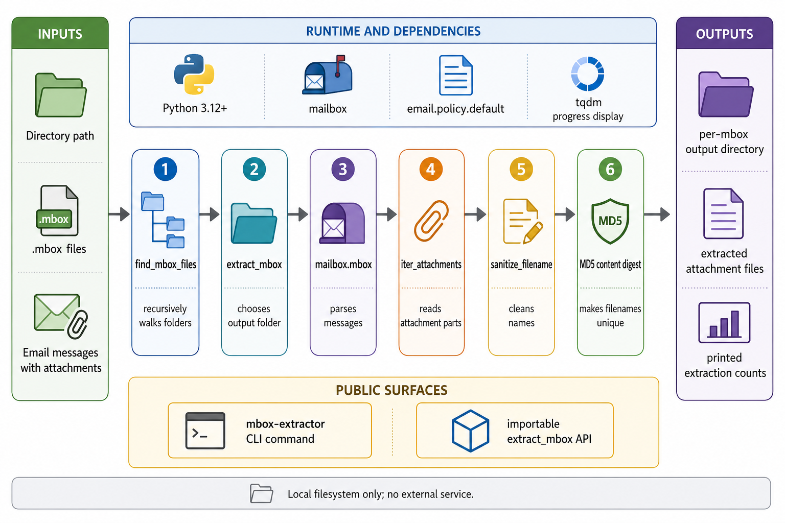

<div align="center">
  

  **📨 Extract all attachments from mbox email archives recursively 📎**
</div>

mbox-extractor is a Python CLI and importable package for pulling attachments out of `.mbox` email archives. Point it at a directory, and it recursively finds every `.mbox` file, extracts attachment parts, and writes them beside each archive.

It is useful for local mailbox exports where attachments need to be recovered without manually opening each message.

## Install

```bash
uv tool install mbox-extractor
```

Run it against a directory that contains one or more `.mbox` files:

```bash
mbox-extractor /path/to/search
```

## From Source

```bash
git clone https://github.com/tsilva/mbox-extractor.git
cd mbox-extractor
uv tool install .
mbox-extractor /path/to/search
```

## Commands

```bash
uv tool install mbox-extractor      # install the published CLI
uv tool install .                   # install this checkout as a CLI tool
mbox-extractor /path/to/search      # extract attachments from all .mbox files below a path
uv run python -c "from mbox_extractor import extract_mbox; print('OK')"  # verify import
```

## Python API

```python
from mbox_extractor import extract_mbox

count = extract_mbox("/path/to/archive.mbox")
count = extract_mbox("/path/to/archive.mbox", output_dir="/custom/output")
count = extract_mbox("/path/to/archive.mbox", show_progress=False)
```

`extract_mbox` returns the number of attachments written. When `output_dir` is omitted, attachments go into a folder with the same path as the source `.mbox` file without the extension.

## Notes

- Requires Python 3.12 or newer.
- Uses `email.policy.default` and Python's `mailbox.mbox` parser.
- Attachment filenames are sanitized and made unique with an 8-character MD5 digest of the file content.
- The CLI prints progress with `tqdm`; pass `show_progress=False` when using the Python API in scripts.
- Extraction is local filesystem work only. No external service is called.
- Maintainer releases use the `release-%` Makefile target, which bumps the Hatch version, commits, and pushes.

## Architecture



## License

[MIT](LICENSE)
